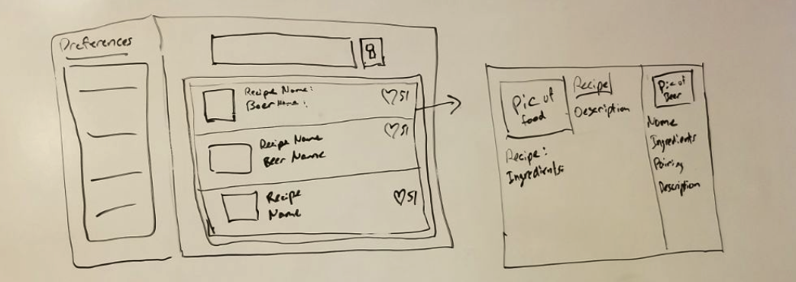
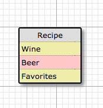
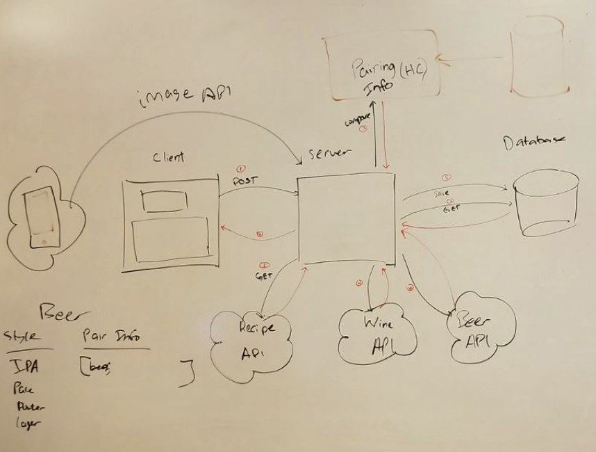

# App plan for FoodPair

## App overview

Deliver best food – beverage (wine or beer) pairings, based on user preferences and inputs.'

## Mocks / Wireframes

## Schema

## Architecture

## Tools and technologies we plan to use

React, React Native, MongoDB, Mongoose, Nodejs, Express, ES6 – Babel, ESLinter, Passport for FB Auth, WebPack, Bootstrap, Mocha + chai for tests, Jest for React testing, Coveralls, Heroku.
MERN Stack. 

## What will be cool / hard / done from scratch?

We will build our own API for food – drinks pairings. We will build web and mobile versions of our app. 

## Ownership

Front – End: Steven, Michael
Back – End: Yermek, Alex
API from scratch: Alex
API-beer: Yermek
API-wine: Steven
API-recipes: Michael
API-image recognition: Alex